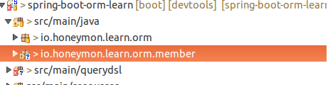
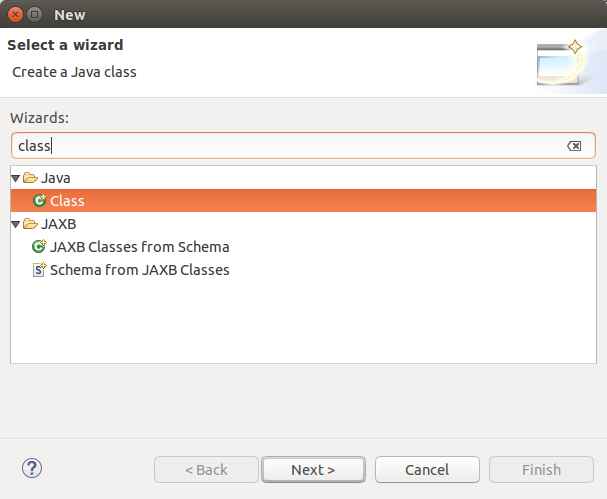
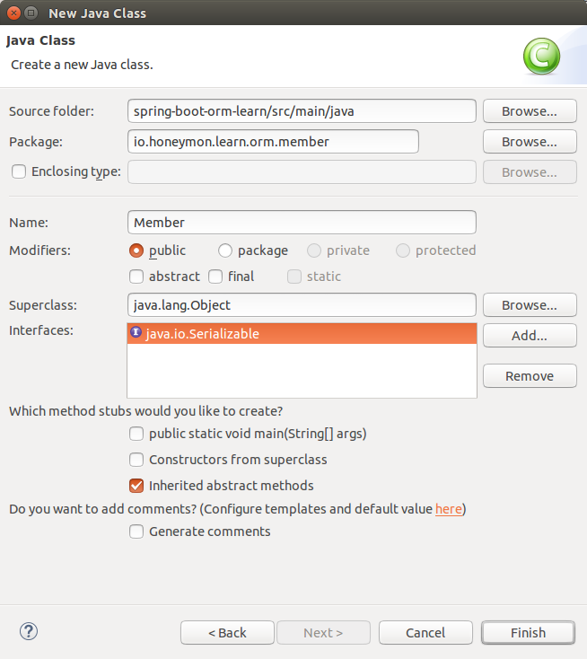
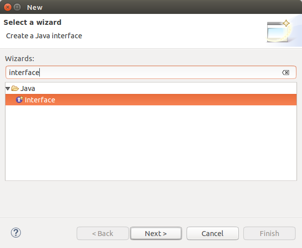
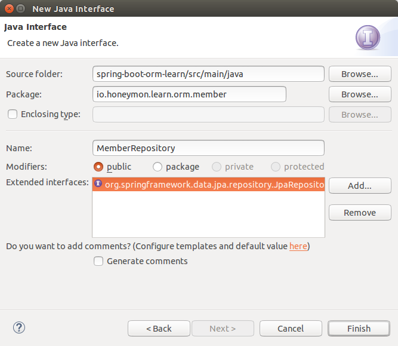
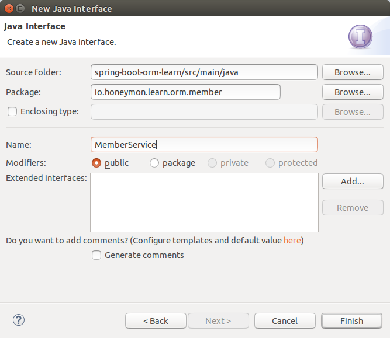
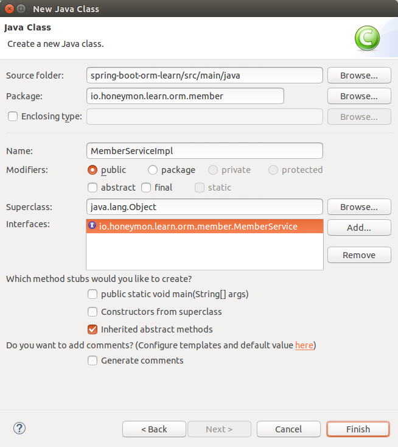
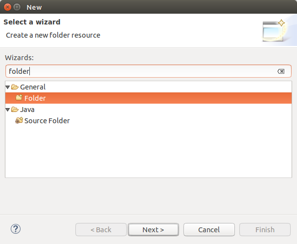
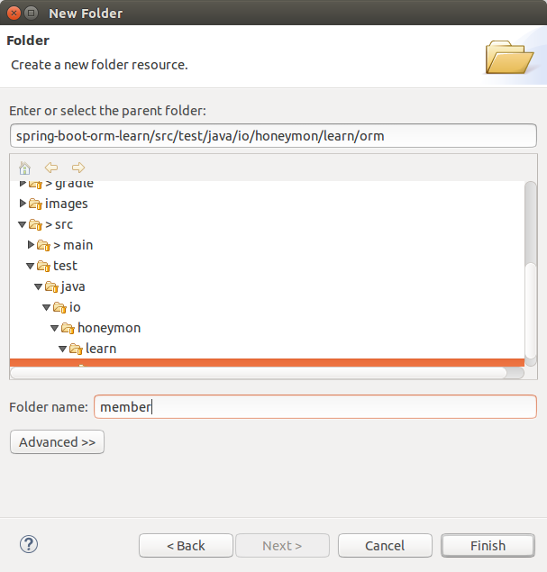
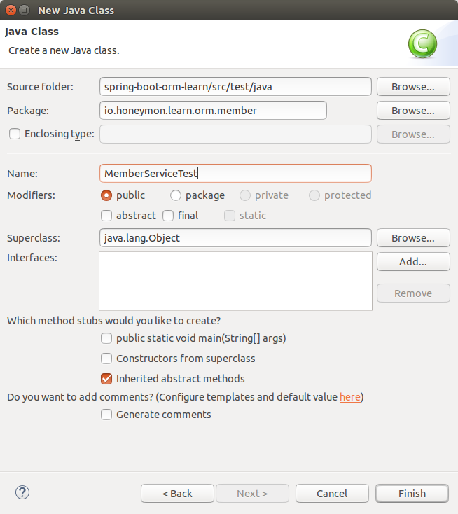

# Member Entity Training
* MemberRepository, MemberService, MemberServiceImpl 을 만들고 MemberServiceTest 를 이용해서 기능을 테스트

## Member.java
1. Create member folder  


2. Create Member.java  
  1. Select A Wizard  
    

  2. Create a new Java class  
  

    >serializable 구현 -> 직렬, 역직렬화 가능

3. Member.java  
  ```java
  package io.honeymon.learn.orm.member;

  import java.io.Serializable;

  import javax.persistence.Entity;
  import javax.persistence.GeneratedValue;
  import javax.persistence.Id;

  import lombok.EqualsAndHashCode;
  import lombok.Getter;
  import lombok.Setter;
  import lombok.ToString;

  @EqualsAndHashCode // equals(), hashCode() 메소드의 코드를 생성.
  @ToString // toString() 메소드 생성
  @Entity // Entity로 설정
  public class Member implements Serializable {

  	private static final long serialVersionUID = 8333809199125923714L;

  	@Getter //Getter 함수를 생성.
  	@Id //Id로 설정
  	@GeneratedValue //자동 생성되는 값
  	private Long id;

  	@Getter //Getter 함수를 생성.
  	@Setter //Setter 함수를 생성.
  	private String name;
  	@Getter //Getter 함수를 생성.
  	@Setter //Setter 함수를 생성.
  	private String email;
  }
  ```

## MemberRepository.java
1. Create MemberRepository.java  
  1. Select a wizard  
  

  2. Create a new Java Class  
  

2. MemberRepository.java
  ```java
  package io.honeymon.learn.orm.member;

  import org.springframework.data.jpa.repository.JpaRepository;
  import org.springframework.stereotype.Repository;

  @Repository // Repository로 설정
  public interface MemberRepository extends JpaRepository<Member, Long> {

  }
  ```

## MemberService.java
1. Create MemberService.java
  1. Select a wizard  
  

  2. Create a new Java Class  
  

2. MemberService.java  
  ```java
  package io.honeymon.learn.orm.member;

  /**
   * {@link Member} 에 대한 서비스를 관리하는 인터페이스
   *
   * @author jhpark
   *
   */
  public interface MemberService {

  	/**
  	 * Save or Update {@link Member}
  	 *
  	 * @param member
  	 * @return
  	 */
  	Member save(Member member);

  	/**
  	 * Delete {@link Member}
  	 *
  	 * @param member
  	 */
  	void delete(Member member);

  	/**
  	 * Fine {@link Member} by {@link Member#getId()}
  	 *
  	 * @param id
  	 * @return
  	 */
  	Member findId(Long id);
  }
  ```

## MemberServiceImpl.java
1. Create MemberServiceTest.java
  1. Select a Wizard  
  

  2. Create a new folde resource  
  

2. MemberServiceImpl.java  
  ```java
  package io.honeymon.learn.orm.member;

  import org.springframework.beans.factory.annotation.Autowired;
  import org.springframework.stereotype.Service;
  import org.springframework.transaction.annotation.Transactional;

  @Transactional(readOnly = true)
  @Service
  public class MemberServiceImpl implements MemberService {

  	@Autowired
  	private MemberRepository repository;

  	@Transactional
  	@Override
  	public Member save(Member member) {
  		return repository.save(member);
  	}

  	@Transactional
  	@Override
  	public void delete(Member member) {
  		repository.delete(member);
  	}

  	@Override
  	public Member findId(Long id) {
  		return repository.findOne(id);
  	}

  }
  ```

## MemberServiceTest.java
1. Create test member Folder
  1. Select a wizard  
  

  2. Create a new folde resource  
  

2. Create MemberServiceTest.java
  1. Select a Wizard  
  

  2. Create a new Java Class  
  

3. MemberServiceTest.java
  ```java
  package io.honeymon.learn.orm.member;

  import static org.hamcrest.CoreMatchers.*;
  import static org.junit.Assert.*;

  import org.junit.Test;
  import org.junit.runner.RunWith;
  import org.springframework.beans.factory.annotation.Autowired;
  import org.springframework.boot.test.SpringApplicationConfiguration;
  import org.springframework.test.context.junit4.SpringJUnit4ClassRunner;
  import org.springframework.test.context.web.WebAppConfiguration;
  import org.springframework.transaction.annotation.Transactional;

  import io.honeymon.learn.orm.OrmLearnApplication;

  @RunWith(SpringJUnit4ClassRunner.class)
  @SpringApplicationConfiguration(classes = { OrmLearnApplication.class })
  @WebAppConfiguration
  @Transactional
  public class MemberServiceTest {

  	@Autowired
  	private MemberService service;

  	public void testname() throws Exception {

  	}

  	@Test
  	public void testMemberSave() throws Exception {
  		// given
  		Member member = new Member();

  		// when
  		Member savedMember = service.save(member);

  		// then
  		assertThat(savedMember, is(member));
  	}

  	@Test
  	public void testDelete() throws Exception {
  		// given
  		Member savedMember = service.save(new Member());

  		// when
  		service.delete(savedMember);

  		// then
  		Member findOne = service.findId(savedMember.getId());
  		assertThat(findOne, is(nullValue()));
  	}
  }
  ```
