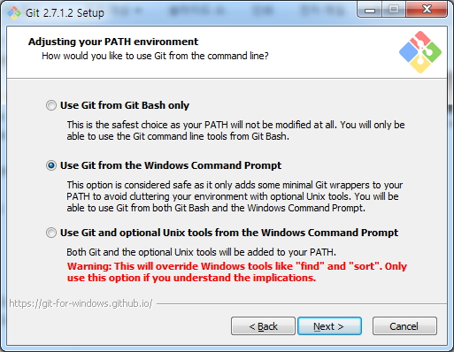
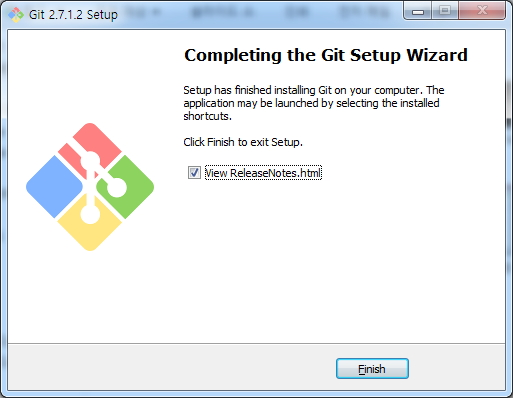
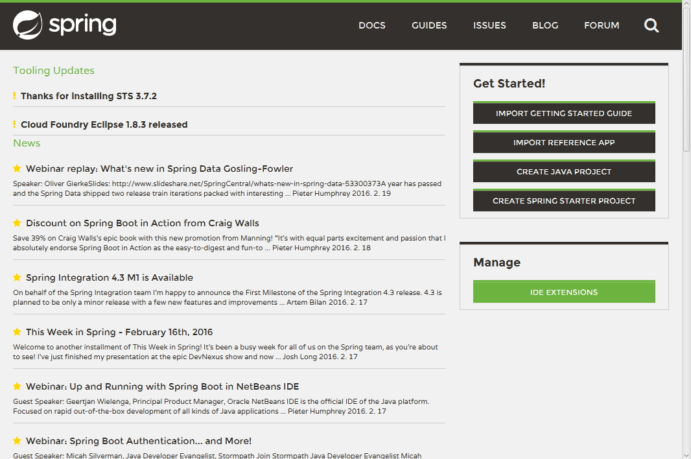
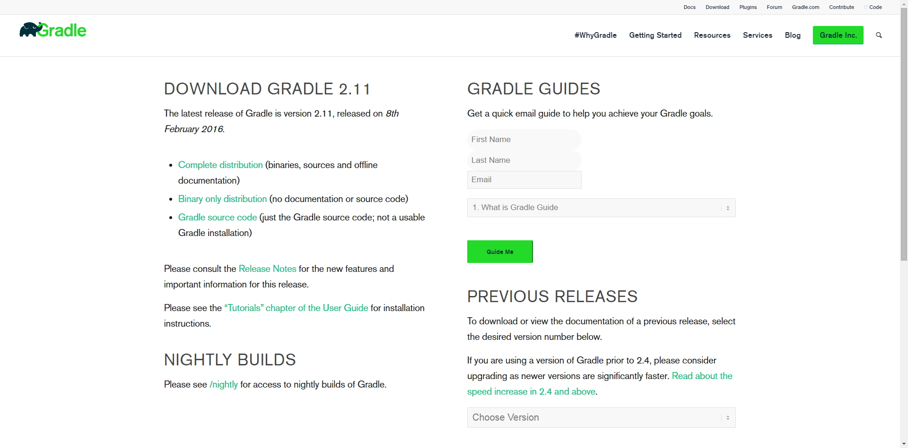
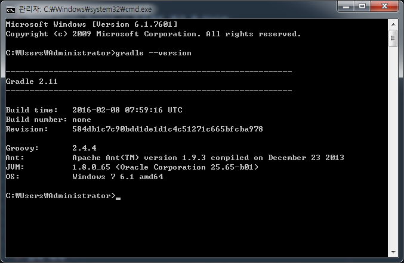

# spring-boot-orm-learn 실습

## Github Sign up and Github Sign in

1. Gitgub Homepage 접속  
[Github Homepage Link](https://github.com/)  


2. Github Sign up  


3. Github Sign in  


## spring-boot-orm-learn Project Fork
1. spring-boot-orm-learn 프로젝트 접속  
[김지헌 과장님(ihoneymon)의 spring-boot-orm-learn 접속](https://github.com/ihoneymon/spring-boot-orm-learn)  


2.  Fork  


3. 자신의 Github 계정에 Clone 되었는지 확인  


## Install Git
1. Git Homepage 접속  
[git-scm Homepage Link](https://git-scm.com/)  


2. Git Download  


3. Git 설치  
Git-2.7.1.2-64-bit.exe 실행  
    1. Information  
    

    2. Select Components  
    

    3. Adjusting your PATH environment  
    

    4. Configuring the line ending conversions  
    

    5. Configuring the terminal emulator to use with Git Bash  
    

    6. Configuring experimental performance tweaks  
    

    7. Completing the Git Setup Wizard  
    

## Git Clone
1. 자신 계정의 프로젝트 URL Copy  


2. git clone 명령어
```
//clone 대상 경로에 위치한 후 명령어
git clone https://github.com/hipark/spring-boot-orm-learn.git
```


3. git clone 확인  


## STS 설치

1. Spring Tool Suite Homepage 접속  
[Spring Tool Suite Homepage Link](https://spring.io/tools)  


2. Spirng Tool Suite Download  


3. 다운받은 spring-tool-suite-3.7.2.RELEASE-e4.5.1-win32-x86_64.zip 압축 풀고 원하는 장소에 위치 후 실행 + workspace 설정

## Gradle Extention Install
1. STS 첫 화면의 Dashboard 에서 IDE EXTENSIONS 클릭  


2. Gradle (STS Legacy) Support 체크, Install 클릭  


3. Gradle IDE 체크, Next 클릭  


4. Install Details 확인 후 Next  


5. Review Licenses 에서 라이센스 동의  


## spring-boot-orm-learn Project Import
1. Package Exploler View 에서 마우스 우클릭 후 Import -> Gradle Project 선택 후 Next  


2. Browse 클릭  


3. Root folder 선택  


4. Build Model 클릭  


5. Build 진행 중  


6. Import Gradle Project -> 프로젝트 체크 후 Finish  


7. Project Import 확인  


## Run Spring Boot App
1. 프로젝트 Context Menu - Run AS - Spring Boot App Click  


2. Console 확인  


## Install Gradle
1. Gradle Download  
[Gradle Download Page Link](http://gradle.org/gradle-download/)


2. 압축 해제  


3. 환경 변수 설정  
Path에 `GRADLE_HOME/bin` 추가  
  


4. 설치 확인  
```
gradle --version
```


## 실행가능한 jar 파일 생성
1. cmd에서 gradle build 입력
```
gradle build
```


2. Build Successful 확인  


3. 해당프로젝트/build/lib 경로에 jar 파일 생성된다.

## jar로 Project 실행
1. `java -jar` 명령어로 Project 실행
```
java -jar springboot-orm-learn-0.0.1-SNAPSHOT.jar
```


2. 서버 실행 확인  

